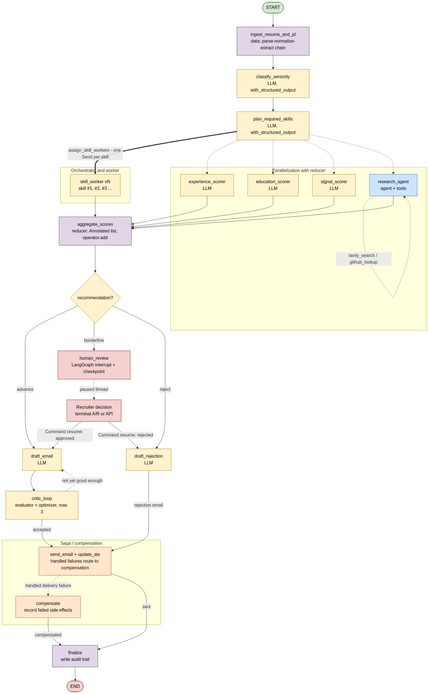

# HireGraph

HireGraph is a LangGraph-based hiring workflow that reads a resume and job
description, classifies the candidate, scores independent dimensions in
parallel, performs optional public research, routes a recommendation, drafts an
email, and pauses borderline cases for a human decision.

See [ARCHITECTURE.md](ARCHITECTURE.md) for the complete graph, state, node,
service, API, checkpoint, and file-level design.

## Setup

```powershell
uv sync
Copy-Item .env.example .env
```

Python 3.11 or newer is required.

Runtime selection is per service:

- `HIREGRAPH_USE_MOCKS=true` forces all deterministic mocks.
- With mocks disabled, OpenAI is real when `OPENAI_API_KEY` is set.
- Tavily is real when `TAVILY_API_KEY` is set.
- GitHub uses the public REST API even without a token; a token raises rate limits.
- Mailtrap is real when `MAILTRAP_PASS` is set.
- Redis is used only when `CHECKPOINTER=redis` and `REDIS_URL` is set and reachable.
- Missing OpenAI, Tavily, or Mailtrap credentials make only that service use its mock.

## Mocks vs real APIs

Every external service has a deterministic mock, so a keyless clone runs end to
end. Each service is chosen **independently, at the call site**: it uses the real
API when its key is present (and `HIREGRAPH_USE_MOCKS` is not `true`), otherwise
the mock. A partially configured `.env` therefore uses real APIs where it can and
mocks the rest, with no code change.

| Service | Real implementation | Mock fallback | Selected by |
| --- | --- | --- | --- |
| LLM | OpenAI `gpt-4o-mini` | deterministic `MockChatModel` (no network) | `OPENAI_API_KEY`, `HIREGRAPH_USE_MOCKS` |
| Web search | Tavily API | canned "public mention" string | `TAVILY_API_KEY`, `HIREGRAPH_USE_MOCKS` |
| GitHub | GitHub REST API (token optional) | stub profile (`12 repos, 30 followers`) | `HIREGRAPH_USE_MOCKS` (public API otherwise) |
| Email | Mailtrap sandbox SMTP | print-only, nothing sent | `MAILTRAP_PASS`, `HIREGRAPH_USE_MOCKS` |
| ATS | in-process id generator | same (always local) | always local |
| Checkpointer | Redis (`RedisSaver`) | `InMemorySaver` | `CHECKPOINTER`, `REDIS_URL` |
| Document read | PyMuPDF (`.pdf`) / file read (`.md`) | n/a (local only) | file extension |

`HIREGRAPH_USE_MOCKS=true` forces every row to the mock column at once.

## Run All Samples

`main.py` renders the graph, runs Priya, Eitan, Mira, and Shivani against the
senior backend JD, auto-approves borderline interrupts, and prints a scoreboard.

```powershell
uv run python main.py
```

Force a fully deterministic offline run:

```powershell
$env:HIREGRAPH_USE_MOCKS="true"
uv run python main.py
```

Run with configured real services:

```powershell
$env:HIREGRAPH_USE_MOCKS="false"
uv run python main.py
```

## Run One Resume

Use the interactive command when you need to see a real terminal pause for a
borderline candidate:

```powershell
uv run hiregraph-resume "sample_data/resumes/resume_eitan.md" "sample_data/jds/jd_senior_backend.md"
```

Other sample commands:

```powershell
uv run hiregraph-resume "sample_data/resumes/resume_priya.md" "sample_data/jds/jd_senior_backend.md"
uv run hiregraph-resume "sample_data/resumes/resume_mira.md" "sample_data/jds/jd_senior_backend.md"
uv run hiregraph-resume "sample_data/resumes/Shivani_Resume.pdf" "sample_data/jds/jd_senior_backend.md"
```

At a borderline checkpoint the terminal waits for:

```text
Decision [A]pprove / [R]eject:
```

Use `--auto-approve` for non-interactive execution. Use `--thread-id ID` to
resume a previously paused Redis-backed thread.

## Design

The compiled graph (regenerated on every `main.py` run):



A linear intake spine, a two-way parallel fan-out feeding one reducer, and a
decide-and-act tail:

```text
START
  -> ingest_resume_and_jd
  -> classify_seniority
  -> plan_required_skills
       -> skill_worker x N through Send        (dynamic, one per required skill)
       -> experience_scorer
       -> education_scorer
       -> signal_scorer
       -> research_agent                       (fixed scorers, static fan-out)
  -> aggregate_scores                          (reducer + barrier)
  -> route_recommendation
       advance    -> draft_email -> critic_loop
       borderline -> human_review -> draft_email or draft_rejection
       reject     -> draft_rejection
  -> send_email_update_ats
       success -> finalize
       handled failure -> compensate -> finalize
  -> END
```

Where each pattern lives:

| Pattern | Where in the code |
| --- | --- |
| State design + reducers | `state.py` — `completed_scores`, `audit_trail`, `critic_feedback`, `compensation_log` are additive |
| Prompt chaining | `ingest_resume_and_jd` — parse -> normalize -> extract |
| Structured output | every LLM call via `with_structured_output(...)` against `schemas.py` |
| Routing | `route_recommendation` — advance / borderline / reject |
| Parallelization + reducer | 3 scorers + N skill workers -> `completed_scores` -> `aggregate_scores` |
| Orchestrator + worker (Send) | `plan_required_skills` -> `assign_skill_workers` -> `skill_worker` |
| Agent with tools + ToolNode | `research_agent` (nested `MessagesState` graph, `handle_tool_errors=True`) |
| Evaluator + optimizer | `draft_email` <-> `critic_loop` (bounded by `EMAIL_MAX_REVISIONS`) |
| Retries (RetryPolicy) | `research_agent`, `send_email_update_ats` with narrow `retry_on=` |
| Human in the loop | `human_review` `interrupt()` + checkpointer, resume by `thread_id` |
| Saga / compensation | `send_email_update_ats` failure -> `compensate` -> `finalize` |

`completed_scores`, `critic_feedback`, `compensation_log`, and `audit_trail` use
additive reducers. The research agent is a nested `MessagesState` graph with an
LLM/tool loop; its messages do not enter the main persisted state. The
compensation branch records that external reconciliation is required; it does not
claim to transactionally undo SMTP delivery or an ATS write.

Full design detail is in [ARCHITECTURE.md](ARCHITECTURE.md).

## API

```powershell
uv run uvicorn api.server:app --reload --port 8000
```

Endpoints:

- `GET /api/health`
- `GET /api/samples`
- `POST /api/run`
- `POST /api/resume/{thread_id}`
- `GET /api/graph.png`

The API is a demo backend: it has wildcard CORS and no authentication. Do not
expose it directly to an untrusted network.

## Trade-offs

- **Model: `gpt-4o-mini`.** Classification, bounded scoring, and short emails do
  not need a reasoning model; `gpt-4o-mini` is fast and cheap. The factory applies
  `reasoning_effort="low"` only to reasoning models, so switching `HIRE_MODEL`
  needs no code change.
- **Per-service mocks over one global switch.** Each service is mocked
  independently at the call site, so a partially configured `.env` uses real APIs
  where it can. The cost is a little duplicated guard logic in `services.py`.
- **Bounded loops over exhaustive retries.** `RetryPolicy(max_attempts=3)` on the
  two external nodes; the critic loop is capped at `EMAIL_MAX_REVISIONS=3`. Work is
  bounded by design.
- **Wide borderline band.** The seniority bars route an under-leveled but capable
  candidate into human review rather than auto-reject — trading some automation for
  safer decisions and a reliable demo of the `interrupt()` path.
- **Compensation logs, it does not unsend.** A real saga cannot recall an SMTP
  message; `compensate` records that reconciliation is required and reaches a clean
  terminal state instead of pretending to roll back delivery.
- **Redis checkpointer with in-memory fallback.** Durable resume across a process
  restart when wired; never crashes when Redis is absent or unreachable.

## Verification

```powershell
uv run pytest -q
uv run ruff check src api tests main.py
```

Captured real-service outcomes are in
[`sample_data/output.md`](sample_data/output.md). Expected verdicts vs the senior
backend JD: Priya senior / advance, Eitan mid / borderline (pauses), Mira senior /
reject.
